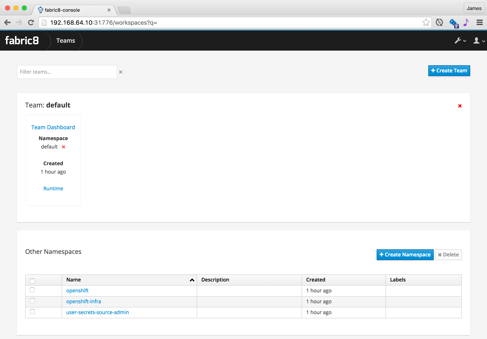
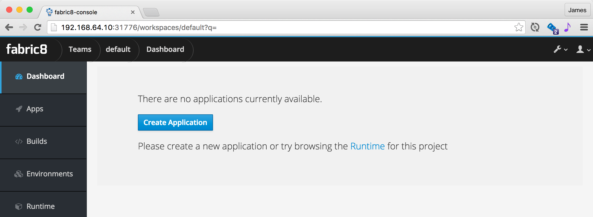
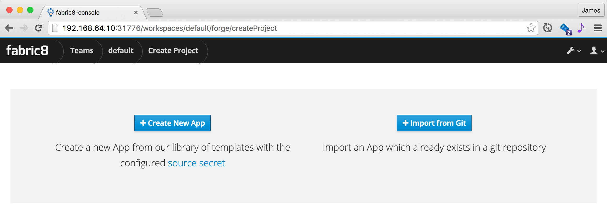
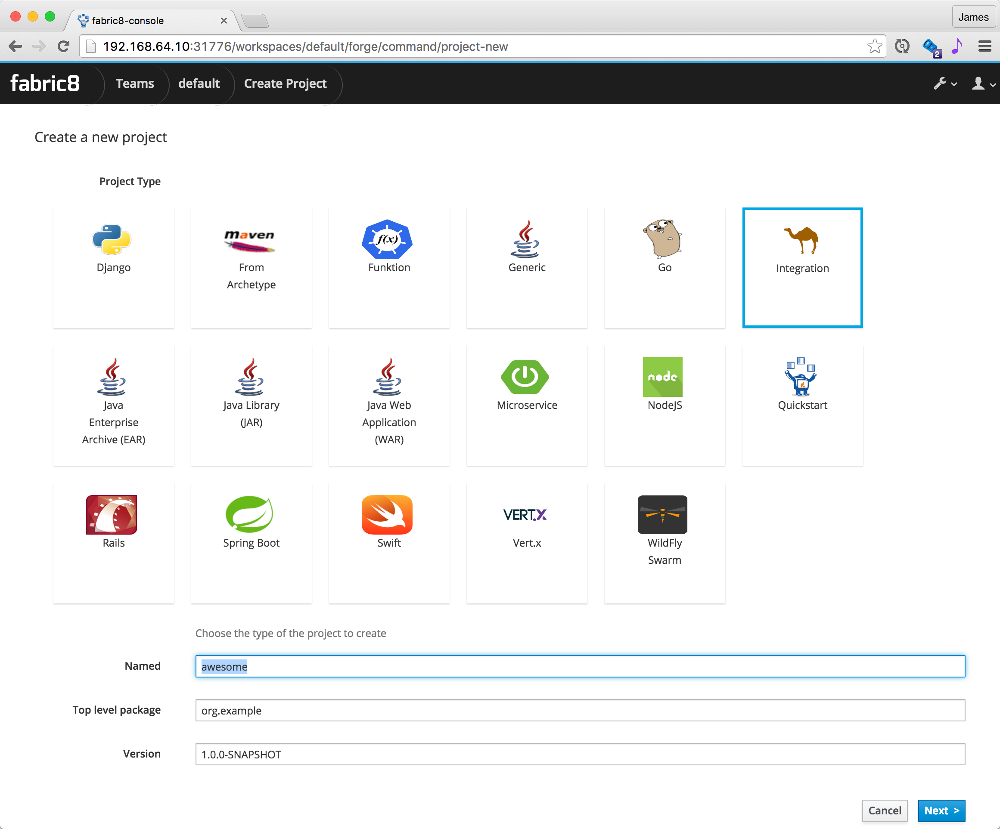
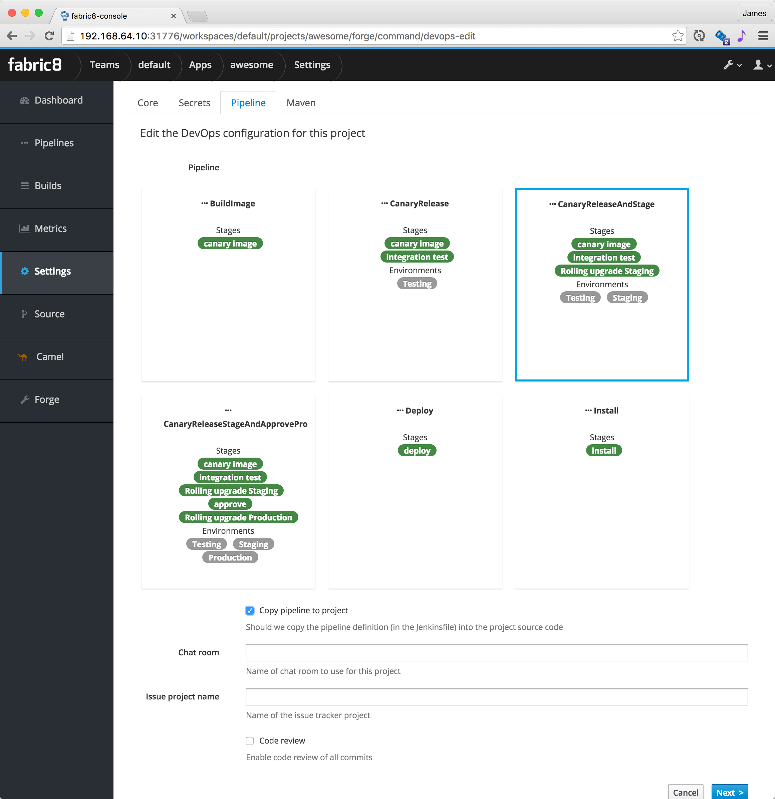
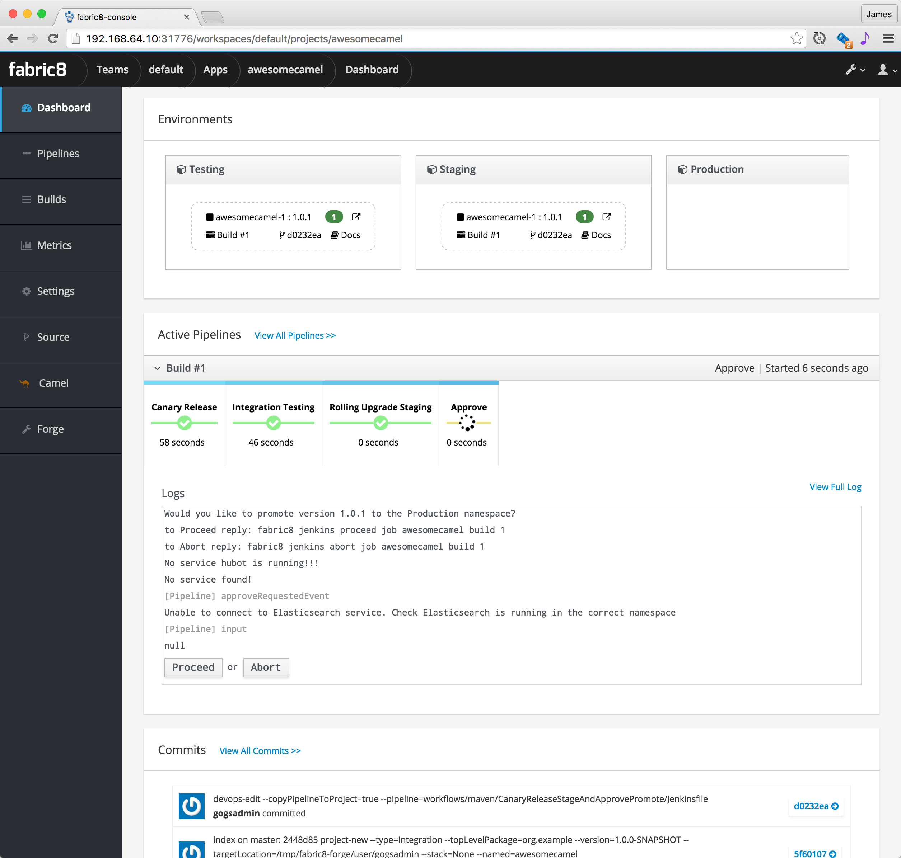

## Fabric8 Developer Console

Fabric8 Developer Console provides a rich HTML5 web application for creating, building, testing and managing Microservices on [Kubernetes](http://kubernetes.io/) or [Openshift](https://www.openshift.org/).

See the [Getting Started Guide](getStarted/index.html) for how to install it.

### Opening the Fabric8 Console

If you are using [minishift](getStarted/minishift.html) or [minikube](getStarted/minikube.html) then you open the fabric8 console via the command

```sh
minikube service fabric8
minishift service fabric8
```

Depending on if you are using minikube or minishift.

Otherwise you typically use a URL like `http://fabric8.${DOMAIN}` where `DOMAIN` is the domain you used to [install fabric8](getStarted/index.html)

### Getting Started

When you open the fabric8 console you should see a screen like this:



A `Team` is a kubernetes namespace running your development tools (like Jenkins, Nexus, JBoss Forge) and is associated with a number of environments (Testing, Staging, Production etc).

Click on the `Team Dashboard` which should take you to the Team Dashboard where you can create new apps or view your existing apps:



If you click the `Create Application` you get to the create wizard page:



Then you get to pick what kind of project you wish to create and its name:



Then choose your [CD Pipeline](cdelivery.html):



If you choose `Copy pipeline to project` then the Jenkinsfile that defines the pipeline gets copied into your project's git repository so that you can easily edit it later on via a versioned source code change just like any other code change.

Now you will be taken to the `App Dashboard` where you can see all the environments and active pipelines along with recent commits on a single pane of glass. This is how it looks once the Canary release, Testing and Staging is complete; waiting for Promotion to Production



You can click on the `Proceed` button to promote to Production, or `Abort` to stop the pipeline.

You can easily switch between all your development tools (Gogs, Jenkins, Nexus etc) using the tool drop down menu at the top right of the screen:


### Runtime tabs

The `Team` page has a `Runtime` tab that lets you browse the runtime of your development environment. Or from the home page you can click on an environment page to view its runtime.

The `Runtime` pages have a number of tabs that let you work with the various Kubernetes resources. We'll highlight the main ones you'll need to use:

#### Replicas

The main tab to get a feel for what's running in your system is the **Replicas** tab which shows all the [replication controllers](replicationControllers.html) or ReplicaSets on Kubernetes.

To scale up or down a controller to run more or less [pods](pods.html) (containers) just increase or decrease the **Desired Replicas** value and hit **Save** and hey presto pods are created or destroyed.


#### Overview

The **Overview** tab gives you a feel for how all the various [services](services.html) and  [replication controllers](replicationControllers.html) interact:


#### Library

The **Library** tab lets you drag and drop [Apps](apps.html) into your library from downloaded [App Zips](appzip.html) so that you can see all the available applications you can run. Click on an app then hit **Run** to run them.

You can also drag folder from the Library to your desktop and local file system to save them.


### Using Kubernetes/OpenShift

If you are using Kubernetes or OpenShift you need to find the URL for the console service. From there you should be able to navigate to the tabs for [pods](pods.html), [replication controllers] and [services](services.html).

If you use the [Fabric8 Vagrant](getStarted/vagrant.html) approach then the URL is `http://fabric8.vagrant.f8/`.

Otherwise you need to find the host name to use.

e.g. on OpenShift V3 you can find it via:

    oc get route fabric8

