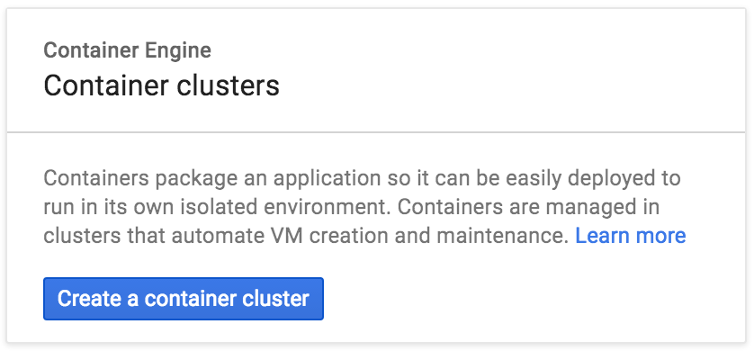
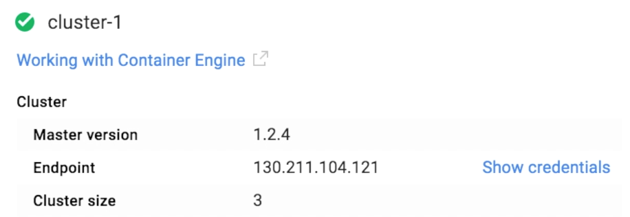

## Getting Started with Kubernetes on Google Container Engine

It is very easy to get up and running with Google Container Engine (GKE) and the docs are extremely well structured.  Before you start you should read the short GKE [overview](https://cloud.google.com/container-engine/docs/#overview) and especially familiarise yourself with the [pricing](https://cloud.google.com/container-engine/docs/#pricing) information!

### Before you begin
To start you will need to sign up for an account, enable billing and install on your local machine the `gcloud` and `kubectl` client binaries.  All this can be done by following the [Google before you begin guide](https://cloud.google.com/container-engine/docs/before-you-begin).

### Creating a container cluster

Now you are ready to create a cluster on GKE.  To start with we recommend creating a cluster of two or three instances which can be used to familiarise yourself with the architecture and components without incurring too much cost.  You can easily build up the cluster later.

Go to [Google Container Engine website](https://cloud.google.com/container-engine/), from here you can click to be taken to your [Console](https://console.cloud.google.com/kubernetes/).



Now that you've created your cluster you should be able to use `kubectl` as described above to remotely connect and interact with your new Kubernetes cluster. For example to authenticate, set the following ENV VARS in a terminal taken from the Google Container Engine console.



```
KUBERNETES_USERNAME=
KUBERNETES_PASSWORD=
KUBERNETES_SERVER=
```

Once the above ENV VARS are set you can authenticate against your new cluster from your local machine using

```
kubectl config set-credentials demo --username=$KUBERNETES_USERNAME --password=$KUBERNETES_PASSWORD
kubectl config set-cluster demo --insecure-skip-tls-verify=true --server=https://$KUBERNETES_SERVER
kubectl config set-context demo --user=demo --namespace=default --cluster=demo
kubectl config use-context demo
```

Check your nodes are running

```
kubectl get nodes
```

### Install the fabric8 microservices platform default applications

Next we want to deploy the fabric8 microservices platform components on top of Kubernetes, get the latest `gofabric8` binary from  [gofabric8](https://github.com/fabric8io/gofabric8/releases) and run

```
gofabric8 deploy
```
gofabric8 will use the local credentials on your remote machine from `~/.kube/config` after the authentication script above

It may make a few minutes to download a number of docker images but to track progress you can watch progress using
```
kubectl get pod -w
```
As soon as the fabric8-xxxx pod is running you can open a URL to the fabric8 console
```
open https://$KUBERNETES_SERVER/api/v1/proxy/namespaces/default/services/fabric8/
```

### Using the console

Here is a [video showing you what you can do with the console on Google Container Engine (GKE)](https://vimeo.com/172948055)


<div class="row">
  <p class="text-center">
      <iframe src="https://player.vimeo.com/video/134408470" width="1000" height="562" frameborder="0" webkitallowfullscreen mozallowfullscreen allowfullscreen></iframe>
  </p>
</div>

For more details check the [console documentation](console.html)


### Container Registry

Your GKE project has a [container registry](https://cloud.google.com/tools/container-registry/) that you can use to push images to and reference in you kubernetes configurations.  This is useful if you want to avoid pulling images from dockerhub and also when developing custom images.

For example if your GKE project ID is `fabric8-984`, to Docker build, tag and push to your Google projects container registry

```
docker build --rm -t gcr.io/fabric8-984/fabric8-console .
gcloud docker push gcr.io/fabric8-984/fabric8-console
```

### Load Balancer

The Google Container Load Balancer can take a minute or two to create an external IP that can be used to access your services.  Best way to check is to wait for your Kubernetes services to display an `EXTERNAL_IP` using

```
kubectl get svc -w
```

### Google Container Engine Quotas

It's easy to exceed the default limits provided by GKE when starting out.  Navigating to the GKE Admin dashboard allows you to see how you are doing with your quotas.  For example it was easy to exceed the basic number of forwarding rules, static IPs, firewalls and forwarding rules.  Here are a few `gloud` commands that can help clean up after tearing down a cluster and GC your resources
```
gcloud compute addresses list
gcloud compute addresses delete $(gcloud compute addresses list | cut -f 1 -d ' ')
```
```
gcloud compute target-pools list
gcloud compute target-pools delete $(gcloud compute target-pools list | cut -f 1 -d ' ')
```
```
gcloud compute firewall-rules list
gcloud compute firewall-rules delete $(gcloud compute firewall-rules list | cut -f 1 -d ' ')
```
