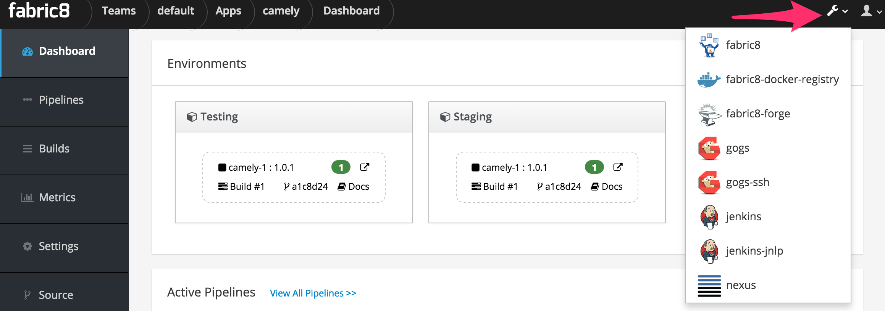

## Getting Started with MiniKube

The easiest way to get started with Fabric8 and Kubernetes on your laptop is via [MiniKube](https://github.com/kubernetes/minikube)

### Start the cluster with minikube start

* [Download a MiniKube binary for your platform](https://github.com/kubernetes/minikube/releases), extract it and add it to your `$PATH`
* type the following command to create a new Kubernetes cluster:

```sh
minikube start --memory=6000
```

Then follow the on screen prompts.

Note that on OS X we recommend you use the `xhyve` driver which avoids you having to install VirtualBox and Vagrant; its also leaner & meaner and requires less memory:

```sh
minikube start  --memory=6000 --vm-driver=xhyve
```

On Windows you should use the `hyperv` driver.

You should now be able to connect to the cluster via the `kubectl` command line tool from Kubernetes which you can [download kubectl for your platform](https://coreos.com/kubernetes/docs/latest/configure-kubectl.html).

```sh
oc get pods
```

### Run the gofabric8 installer

* [Download a gofabric8 binary for your platform](https://github.com/fabric8io/gofabric8/releases), extract it and add it to your `$PATH`

Now type the following:

```sh
gofabric8 deploy -y 
```

At any point you can validate your installation via:

```sh
gofabric8 validate
```


### Access the Fabric8 Developer Console

To open the [Fabric8 Developer Console](../console.html) then type the following:

```sh
minikube service fabric8
```

Then a browse window will open for the console. 

To see the URL so you can open it in another browser you can type:

```sh
minikube service fabric8 --url
```

You can use the same command to open other consoles too like gogs, Jenkins or Nexus

```sh
minikube service gogs
minikube service jenkins
minikube service nexus
```

Though from the [Fabric8 Developer Console](../console.html) you can easily switch between all your development tools using the tool drop down menu at the top right of the screen:


 
#### Configuring Docker
 
To use docker on your host communicating with the docker daemon inside your MiniKube cluster type:

```sh
eval $(minikube docker-env)
```

## Troubleshooting

Check out the [troubleshooting guide](troubleshooting.html) for more help.
